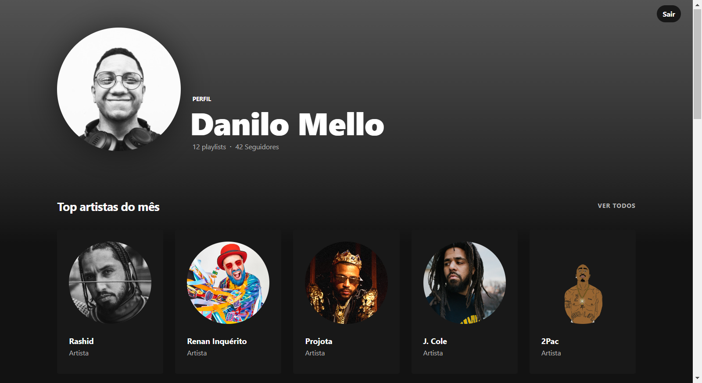

<h1 align="center">
    
</h1>

<br>

## 🧪 Tecnologies

This project was developed with the following technologies:

- [Node](https://nodejs.org/en/docs/guides/getting-started-guide/)
- [React](https://reactjs.org)
- [Styled Components](https://styled-components.com/)
- [Express](https://expressjs.com/pt-br/)
- [Spotify Api](https://developer.spotify.com/documentation/web-api/)

## 🚀 Running the project

Clone the repo

```bash
$ git clone https://github.com/daniilomello/spotify-profile.git
$ cd spotify-profile
```

To run the project, follow the steps below:


```bash
# Create an account on the Spotify website, launch a new app from the dashboard.
https://developer.spotify.com/dashboard/applications

# Create a .env file add the client ID and client secret,
# shown on the dashboard, following the example of the .env.example file
CLIENT_ID=SEU-ID-AQUI
CLIENT_SECRET=SUA-SECRET-AQUI
REDIRECT_URL=http://localhost:8888
FRONTEND_URI=http://localhost:3000


# Add callback url in settings part of your app in Spotify dashboard
http://localhost:8888/callback
```


```bash
# install the dependencies
$ yarn

# start the project
$ yarn start
```
The app will be available in your browser at the address: http://localhost:3000.


## 💻 Projeto

Spotify Profile, é um app para você visualizar de forma personalizada seus dados de uso do Spotify, como número de seguidores, playlists, seus artistas mais ouvidos, e sua músicas mais ouvidas.


## 📝 License

This project is licensed under the MIT.

---

Build with 💜 by Danilo Mello 👋🏻
